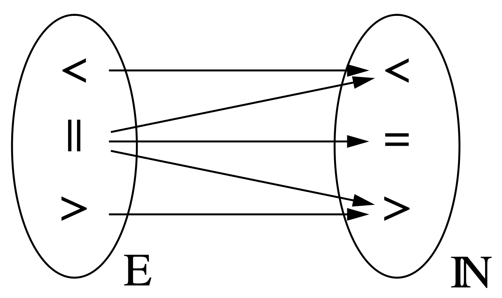

# Vector clocks
$\textit{FastTrack}$, the method described here, uses *Lamport clocks* and *vector clocks* in order to establish a *happens-before* relation between events in complex program traces.

## Lamport clocks

A lamport clock is a funciton 

$$C: E \rightarrow T$$

that assigns timestamps $C(t) \in T$ to any event $e \in E$ while fulfilling the *weak clock-condition*, whose definition is based on the *happens-before* relation from above:

$$e \leq e' \rightarrow C(e) \lt C(e')$$

In his paper, Lamport proposes a mechanism that fulfills this condition. Each process is assigned a clock, with a counter value representing the current local "time". In the beginning they are all set to the same value $t_0$.

1. A process increments its counter before each local event, e. g. when sending a message
2. When a process sends a message, it includes its counter value with the message after executing step 1
3. On receiving a message, the counter of the recipient is set to the greater of its current counter value and the counter value received in the timestamp, and subsequently incremented by 1

TODO: Example with image

### Shortcoming of the Lamport clock

Consider two events $e$, $e'$, that are not casually related ($e || e'$). As a result they might get assigned the same or different timestamps which can lead to three different outcomes:

- $C(e) < C(e') \rightarrow e \leq e'$
- $C(e') > C(e) \rightarrow e' \leq e$
- $C(e) = C(e) \rightarrow (e \leq e') \land (e' \leq e)$

The last statement however destroys the information about the two events *not* casually influencing each other, as it states that $e$ *might have* casually influenced $e'$ and $e'$ *might have* casually influenced $e$. This is the exact opposite of the definition of two events *not* casually influencing each other. 
We can see from the figure below that the Lamport clock is a homomorphism, not an isomorphism:

In order to preserve information about two events *not* casually influencing each other, we would need a way to store the negation of the *happens-before* relation $\neg(e \leq e')$. With this, the information of two events *not* casually influencing each other could be represented by the expression

$\neg(e \leq e') \land \neg(e' \leq e)$

Vector clocks achieve this by replacing the single logical clock per thread with a vector of logical clocks (*vector clock*) per thread, with one vector entry for each thread of the program.

## Vector clocks

A vector clock 

### Sources

- Lamport clocks: https://lamport.azurewebsites.net/pubs/time-clocks.pdf
- Vector clocks: https://www.vs.inf.ethz.ch/publ/papers/VirtTimeGlobStates.pdf
