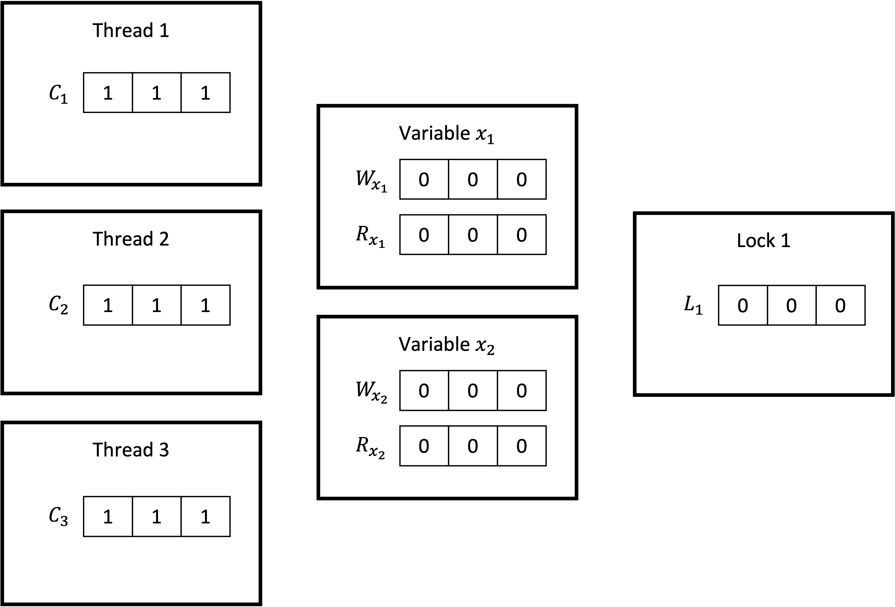
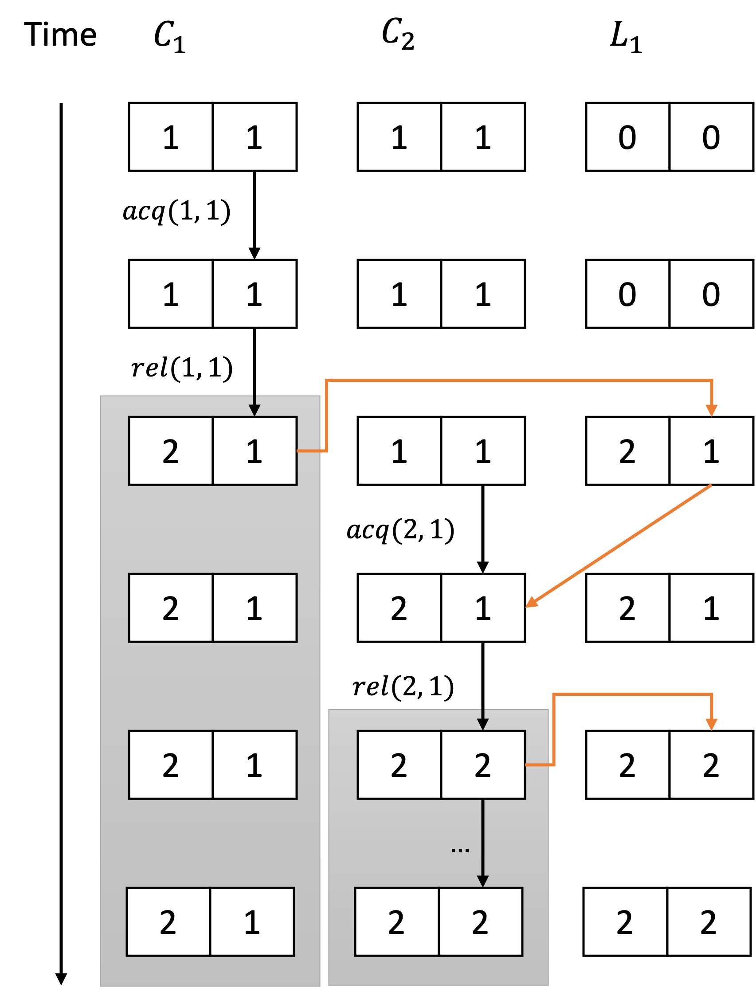

# DJIT+

Based on [this paper](https://www.researchgate.net/publication/220105596_MultiRace_efficient_on-the-fly_data_race_detection_in_Multithreaded_C_Programs_Research_Articles)
To identify data races, i.e. concurrent conflicting accesses, a *happens-before* relationship has to be established between the actions of different threads. To that end, the `DJIT+` algorithm `FastTrack` is built on uses vector clocks.

The algorithms maintains vector clocks for three types of objects: 

- **threads** with vector clocks $C_t$
- **variables** with vector clocks $W_{x_i}$ and $R_{x_i}$ for read and write accesses respectively 
- **locks** with vector clocks $L_m$

The number of elements in these vectors equals the number of threads, each element representing one thread. The vector clocks of the threads start with an initial value of 1 for all entries. The vector clocks for variables and locks start with an initial value of 0 for all entries, indicating no access by any thread.
The image represents the initial global state maintained by the DJIT+ algorithm for three threads, two variables and one lock:


### Time frames

DJIT+ splits the program execution of each thread $t$ in *time frames*. Each time frame starts each time the thread performs a release operation  $rel(t, m)$ on a lock $m$. With this, two updates to the vector clocks happen:

1. The $t$'th element of the vector clock $C_t$ of thread $t$ is incremented: 
    
    $C_t[t] \leftarrow C_t[t] + 1$. 
2. The vector clock $L_m$ is set to the supremum of itself and the vector clock $C_t$ of thread $t$ (each entry of the vector clock $L_m$ of lock $m$ is updated to hold the maximum between the current value and that of $t$'s vector): 

    $L_m \leftarrow sup(L_m, C_t) \Leftrightarrow$

    $\forall i: L_m[i] \leftarrow max(L_m[i], C_t[i])$

**Example** 

Consider a program with two threads and one lock. In the initial state of this example, the vector clocks for the threads are set to $[1, 1]$ and the clock for the lock is set to $[0, 0]$.

Thread $1$ now acquires and subsequently releases lock $1$. According to the first rule, the first element of the vector clock $C_1$ of thread $1$ is incremented to the value $C_1 = [2, 1]$. After that, the vector clock $L_1$ of lock $1$ is set to the supremum of $L_1$ and $C_1$: $L_1 \leftarrow sup(L_1, C_1) = [2, 1]$ A new time frame for tread 1 starts here, indicated by the grey box.

Now, thread $2$ acquires lock $1$. Its vector clock is updated to the union of its own vector clock and that of lock 1. Therefore, its value is set to $[1, 2]$.


### Locking

**First rule**

Whenever a thread $t$ releases a lock $m$
1. the corresponding element of the vector clock of this thread $C_t(t)$ is incremented
2. the vector clock $L_m$ of the lock is set to $C_t$

**Seconnd rule**

Whenever a thread $t$ acquires a lock $m$, the vector clock $C_t$ of the thread is updated to be $C_t' = C_t \cup L_m$, i.e. each element of $C_t'$ is set to the maximum of the corresponding elements of $C_t$ and $L_m$.


### Variable reads and writes

**Rule**

Whenever a thread $t$ writes to a variable $x$, the vector clock $W_x$ of variable $x$ is set to the vector clock $C_t$ of the writing thread.

**Example**
Consider a program with two threads and one variable. In the initial state of this example, the vector clock for thread 1 and the write clock for the variable are set to $[0, 0]$, while the vector clock of thread 2 has a starting value of $C_2 = [0, 2]$. First, thread 2 writes to the variable

### Thread State

Each thread has its own state, which is implemented [here](https://github.com/llvm/llvm-project/blob/b57819e130258b4cb30912dcf2f420af94d43808/compiler-rt/lib/tsan/rtl/tsan_rtl.h#L158). It roughly looks like this:

```cpp
struct ThreadState {
    FastState fast_state;
    VectorClock clock;
    const Tid tid;
    bool is_dead;
}
```

```cpp
struct VectorClock {
    // One logical clock value for every thread
    // Epoch is a 16 bit unsigned integer
    Epoch[] clocks;
    
    // Resets the vector clock to [0, ..., 0]
    reset()

    // Acquires a lock
    // src: The vector clock of the lock acquired
    acquire(VectorClock src)

    release(VectorClock dst)
    releaseStore(VectorClock dst)
    releaseStoreAcquire(VectorClock dst)
    releaseAcquire(VectorClock dst)
}
```

### Epoch
An epoch is a pair $(c, t)$ of
- the clock $c$ of
- a thread $t$

It is denoted as $c@t$.

#### Happens-before relation of epochs
An epoch $c@t$ *happens-before* an epoch $c'@t$ if and only if the clock $c$ is less or equal to the clock $c'$:

$c@t \leq c@t$ iff $c \leq c'$

An epoch $c@t$ *happens-before* a vector clock $V$ if and only if the clock of the epoch is less than or equal to the corresponding clock of thread $t$ in the vector clock: 

$c@t \leq V$ iff $c \leq V_t$

#### Code representation

An epoch is represented in the code by a `u_16`

```cpp
enum class Epoch : u16 {};
```

This is part of the `FastState` [here](https://github.com/llvm/llvm-project/blob/b57819e130258b4cb30912dcf2f420af94d43808/compiler-rt/lib/tsan/rtl/tsan_shadow.h#L32) which in turn is part of the state for each thread ([here](https://github.com/llvm/llvm-project/blob/b57819e130258b4cb30912dcf2f420af94d43808/compiler-rt/lib/tsan/rtl/tsan_rtl.h#L159)).